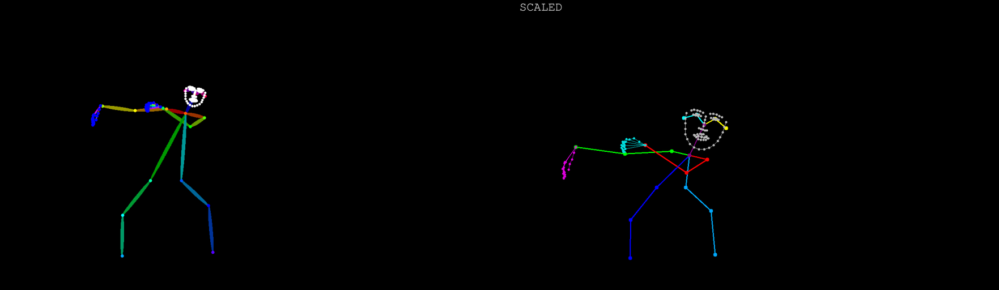

# ComfyUI Warper Nodes

A collection of general-purpose nodes for ComfyUI.

## Current Nodes

*   **DWPose Scaler (Warper):** Provides advanced scaling and adjustment options for DWPose keypoints. (Category: `Warper Tools`)
    

*   **Flow Visualizer (Warper):** Calculates optical flow between image sequences using the RAFT model and provides visual representations (color-coded flow images) for both forward and backward flow. Ideal for understanding motion in your generations. (Category: `Warper Tools/Flow`)
    *   **Model Requirement:** This node requires a RAFT model checkpoint.

*   **Smart Video Batcher (Warper):** Splits image sequences into smaller batches with special padding for the final batch. (Category: `Warper Tools/Looping`)

*   **Get Batch By Index (Warper):** Selects a single image batch from a list of batches by its index. (Category: `Warper Tools/Looping`)

*   **Smart Overlapping Batcher (Warper):** Creates overlapping batches from an image sequence to help maintain temporal consistency. (Category: `Warper Tools/Looping`)

*   **Mouth Mask from Pose (Warper):** Generates a circular mask around the mouth area based on facial keypoints. (Category: `Warper Tools/DWMasking`)

*   **Facial Part Mask from Pose (Warper):** Creates masks for various facial parts (entire face, mouth, eyes) using different shapes (convex hull, ellipse, etc.) based on facial keypoints. (Category: `Warper Tools/DWMasking`)

### Prompt Loading Nodes (Category: `Warper Tools/Prompts`)

*   **Load Prompts from Directory (Warper):** Loads text prompts from `.txt` files in a specified directory with options for batch processing.
    *   **Inputs:**
        *   `directory_path`: Path to directory containing `.txt` files
        *   `skip_first_files`: Number of files to skip from the beginning (useful with incremental integer nodes for sequential access)
        *   `load_cap`: Maximum number of prompts to load at once
    *   **Outputs:**
        *   `prompts`: List of loaded prompt texts
        *   `total_loaded`: Number of prompts successfully loaded
        *   `file_names`: List of filenames that were loaded
    *   **Use Case:** Perfect for batch processing multiple prompts or iterating through a prompt library with an incremental counter node.

*   **Load Single Prompt by Index (Warper):** Loads a single prompt from a directory by its index position.
    *   **Inputs:**
        *   `directory_path`: Path to directory containing `.txt` files
        *   `file_index`: Index of the file to load (0-based)
    *   **Outputs:**
        *   `prompt`: The loaded prompt text
        *   `file_name`: Name of the loaded file
        *   `total_files`: Total number of `.txt` files in the directory
        *   `is_valid`: Boolean indicating if the load was successful
    *   **Use Case:** Ideal for workflows that need to process prompts one at a time with precise index control.

*   **Combine Prompts (Warper):** Combines multiple prompts with customizable separators and formatting.
    *   **Inputs:**
        *   `prompt1-4`: Up to 4 prompt inputs (all optional)
        *   `separator`: Text to insert between prompts (default: ", ")
        *   `prefix`: Text to add before the combined result
        *   `suffix`: Text to add after the combined result
    *   **Outputs:**
        *   `combined_prompt`: The final combined prompt string
    *   **Use Case:** Useful for building complex prompts from multiple sources or adding consistent formatting.

## Installation

1.  Navigate to your ComfyUI `custom_nodes` directory.
2.  Clone this repository:
    ```bash
    git clone https://github.com/AIWarper/ComfyUI-WarperNodes
    ```
3.  **Install RAFT Model (Required for Flow Visualizer Node):**
    *   Download the RAFT model checkpoint: `Tartan-C-T-TSKH-spring540x960-M.pth`
        *   **Download Link:** [Google Drive Folder](https://drive.google.com/drive/folders/1YLovlvUW94vciWvTyLf-p3uWscbOQRWW) (Look for the specified `.pth` file within this folder.)
    *   Create a `raft` folder inside your ComfyUI `models` directory if it doesn't already exist: `ComfyUI/models/raft/`
    *   Place the downloaded `Tartan-C-T-TSKH-spring540x960-M.pth` file into this `ComfyUI/models/raft/` directory.

4.  Install any Python package dependencies (if listed in `requirements.txt`):
    ```bash
    cd ComfyUI-WarperNodes
    pip install -r requirements.txt
    ```
    (If you use ComfyUI's portable version, you might need to use its embedded Python, e.g., `path/to/ComfyUI/python_embeded/python.exe -m pip install -r requirements.txt`. If a `requirements.txt` file is not present, this step may not be needed.)

5.  Restart ComfyUI.

## Usage Notes

*   Ensure the RAFT model is correctly placed as described above for the **Flow Visualizer (Warper)** node to function.
*   The nodes will appear under the "Warper Tools" category in the ComfyUI "Add Node" menu.

---

**TODO:**
*   Add example images/gifs for other nodes.
*   More detailed usage instructions for each node.